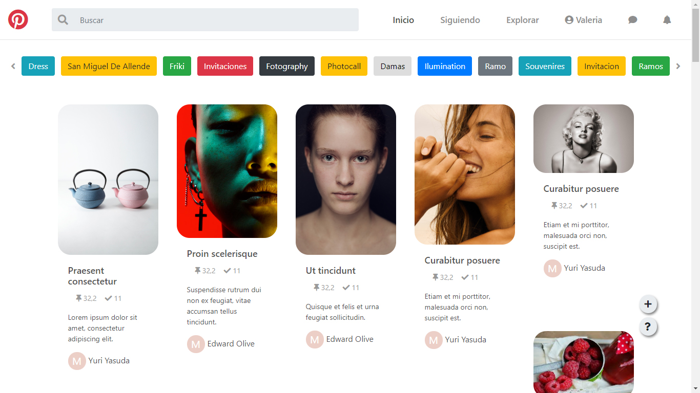
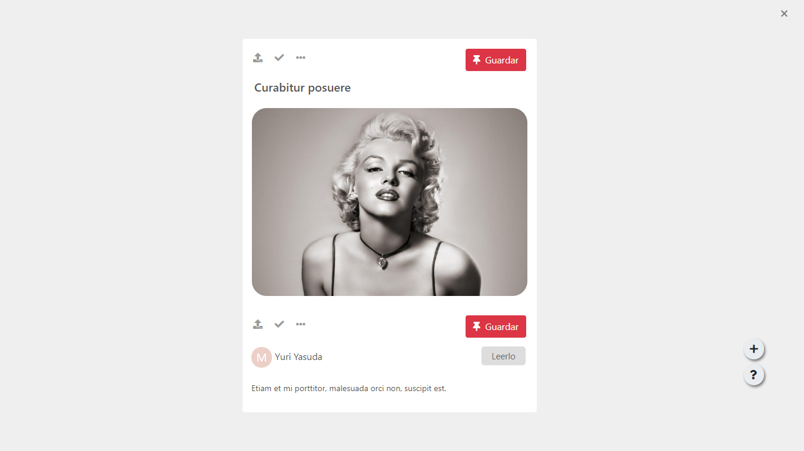
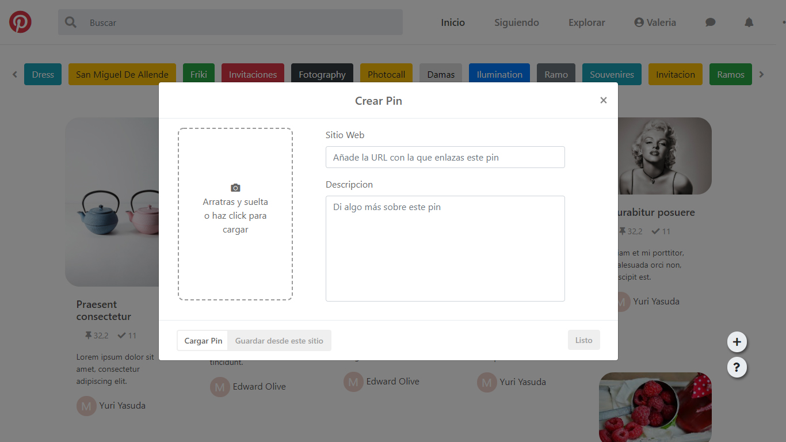

Replica de la maquetación del sitio web de Pinterest

## Tecnología usada

* HTML5
* CSS3
* Bootstrap
* Javascript ECM6
* Json

## Vistas

##

##

## Enlace deploy

https://valepm0511.github.io/Pinterest/index.html